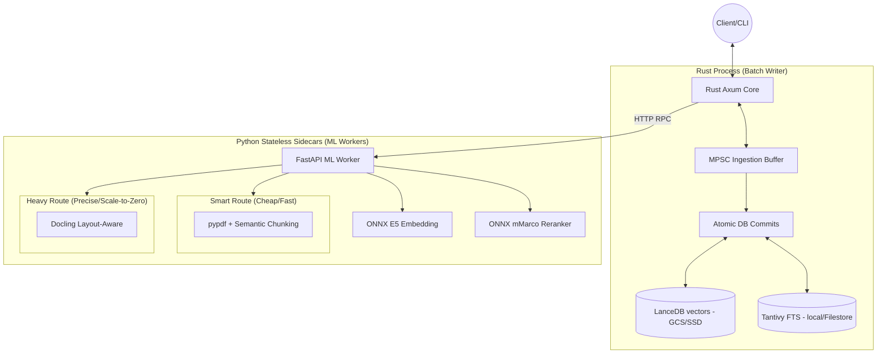

# OneCeroOne (1C1) System Architecture

This document describes the high-level technical architecture of the OneCeroOne headless Retrieval Engine.

## High-Level Overview

OneCeroOne is a local-first, SSD-optimized retrieval core designed for modern AI applications. It combines Rust's concurrency and safety with Python's ML ecosystem to deliver a system that fits under **2GB RAM** while maintaining high accuracy. It utilizes a **Dual-Endpoint Parsing Strategy** to balance speed and quality, and a **Hybrid Search Approach** (LanceDB + Tantivy) to ensure high-precision retrieval on any corpus.

---

## 🔧 Component Breakdown

### 0. 1C1 CLI Tool (Management Layer)
A Python-based CLI wrapper (`./1c1`) provides a user-friendly interface for headless operation. It handles recursive directory traversal, triggers parsing/chunking via the Sidecar, and queues data into the Rust Core's MPSC buffer.

### 1. Dual-Endpoint Ingestion (Cost Optimization)
To mitigate the high compute costs of advanced parsing (IBM Docling) in cloud environments like GCP, 1C1 implements a dual-route strategy:
- **Smart Route (`/parse/smart`)**: Uses `pypdf` for fast text extraction and a **Semantic Chunking** algorithm. It detects topic shifts by calculating cosine similarity between adjacent sentence embeddings (threshold: 0.6). Ideal for standard text-heavy documents.
- **Heavy Route (`/parse/heavy`)**: Uses **IBM Docling** for complex, layout-aware parsing (tables, multi-column layouts). In GCP, this can be deployed as an async worker that scales to zero when idle.

### 2. Rust Core (The Orchestrator)
- **12-Factor App Readiness**: Configured via environment variables (`STORAGE_URI`, `SIDECAR_URL`).
- **Asynchronous MPSC Buffer**: To prevent Optimistic Concurrency Control (OCC) conflicts in cloud object storage (GCS/S3) during high-concurrency writes, the Rust core uses an internal MPSC channel to batch ingestion tasks and ensure atomic commits to LanceDB.
- **Hybrid Retrieval**: Executes dense vector search (LanceDB) and sparse FTS (Tantivy) in parallel, merging results via Reciprocal Rank Fusion (RRF).

### 3. Storage Strategy (SSD-First)
- **LanceDB (Dense)**: Zero-copy Arrow performance. Capable of reading/writing directly to GCS/S3 using the `object_store` crate.
- **Tantivy (Sparse)**: High-performance FTS. Requires a POSIX-compliant filesystem (local SSD or GCP Filestore) for `mmap` performance.
- **Storage Parity**: The system treats local and cloud storage identically via abstracted URIs (e.g., `/data/` vs `gs://bucket/data/`).

---

## Memory & Performance (The Rust Advantage)

### The Microservice Trade-off (Why Not a Monolith?)
A common question in cloud architecture is whether the network overhead between the Rust Core and Python Sidecar negates Rust's performance benefits. In reality, it is the key to cost-efficiency and stability:

1. **Compute vs. Network Bottlenecks:** Network ping within a VPC (e.g., GCP) is ~1ms, whereas embedding text or parsing PDFs in Python takes hundreds of milliseconds or seconds. The HTTP overhead is negligible compared to the ML workload.
2. **Cost & Scale-to-Zero:** A Python monolith with loaded ML models requires large, expensive memory allocations 24/7. By isolating Python into a stateless sidecar, it can **Scale-to-Zero** when there are no ingestion tasks. The entire system is engineered to stay under **2GB RAM**, allowing for cost-effective deployment on entry-level cloud instances.
3. **Concurrency (Fan-out / Fan-in):** Python's Global Interpreter Lock (GIL) limits true concurrency. Rust acts as the orchestrator: it can asynchronously fan-out 100 documents to 10 parallel Python workers, wait for the ML processing without blocking the main search loop, and safely batch the results via MPSC into the database.
4. **Zero-Copy Serialization:** Uses Apache Arrow as the common memory format between Rust and Python (via LanceDB), minimizing serialization overhead and allowing Rust to read memory formed in Python with minimal conversion.

- **Headless by Design**: No UI overhead. All interaction happens via a high-performance REST API or CLI.
- **Scale-to-Zero ML**: The Python sidecar is stateless, allowing for aggressive scaling in serverless environments like Google Cloud Run.

---

## Benchmarking Significance

1C1 focuses on **Scale Invariance**. As the corpus grows, the combination of FTS pre-filtering and Vector re-ranking ensures that precision (MRR) remains stable or improves, rather than degrading into "vector noise."

| Dataset | Type | Scale | Metric | Score |
|---|---|---|---|---|
| **HotpotQA (Hard)** | Multi-Hop | 66k docs | Recall@10 | 91.21%* |
| **MuSiQue-Ans** | Extreme Multi-Hop | 21k docs | Recall@10 | 67.63%* |

> [!NOTE]
> \* These metrics represent "Production Grade" performance achieved using:
> - **Embeddings**: High-tier models (e.g., `gemini-embedding-001` or `text-embedding-3-large`).
> - **Reranking**: Neural Cross-Encoder enabled (`rerank: true`).
> - **Hybrid weights**: Optimized RRF (Reciprocal Rank Fusion) parameters.
>
> Local-first runs using lighter models (like `multilingual-e5-base`) will typically yield 5-15% lower recall on full-scale datasets but offer significantly lower latency.

---

## Security & Portability
- **Platform Agnostic**: Runs on Apple Silicon (MPS), Linux (CPU/CUDA), and GCP Cloud Run.
- **Privacy**: No external API dependencies. All models run locally/within your VPC.
