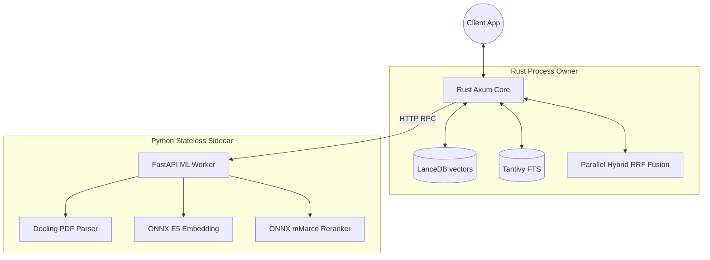

# OneCeroOne (1C1) System Architecture

This document describes the high-level technical architecture of the OneCeroOne headless Retrieval Engine.

## 🏗 High-Level Overview

OneCeroOne is a local-first, memory-optimized headless Retrieval Engine. It combines high-performance document parsing with hybrid vector search to provide a purely private, API-driven core for Retrieval-Augmented Generation (RAG) applications, capable of running on consumer hardware (e.g., 8GB Apple M1).

---

## 🔧 Component Breakdown

### 1. Data Ingestion & ML Sidecar (The "Input" Layer)
- **Rust Axum Core**: A blazingly fast, lightweight API layer that orchestrates the workflow. It receives documents and delegates heavy ML tasks.
- **Python ML Sidecar**: An isolated, stateless worker process that answers HTTP RPC calls from the Rust core. Because it has no persistence loops, memory leaks are eradicated by design.
- **Docling (IBM)**: Used within the sidecar for precise, layout-aware parsing of complex PDFs. 
- **Flat Graph NER**: Entities (Proper Nouns, Dates, Emails) are extracted using regex patterns and stored for highly dense metadata indexing.
- **ONNX vs PyTorch CPU**: While ONNX Runtime is supported, for maximum stability on 8GB machines during sustained load, we utilize PyTorch on CPU. This avoids the high overhead of CoreML/MPS exports during cold-start on restricted hardware.

### 2. Storage & Retrieval (The "Brain")
- **Native LanceDB & Tantivy (Rust)**: The Rust Core communicates directly with the `.lancedb` disk structures using Arrow memory buffers and the `tantivy` FTS engine. No Python overhead is involved during database I/O.
- **Parallel Hybrid Search & RRF**: The Rust core executes dense vector search and sparse FTS searches concurrently using `tokio`, merging the results via the Reciprocal Rank Fusion algorithm.
- **Cross-Encoder Reranker (`cross-encoder/mmarco...`)**: Hosted in the Python Sidecar via ONNX Runtime. The Rust core sends candidate texts to the sidecar for precise pair-wise relevance scoring.

---

## 🧠 Memory Management (The Rust Advantage)

To run state-of-the-art NLP models on an 8GB M1 Mac, OneCeroOne employs a hybrid architecture strategy:

- **Strict Separation of Concerns**: The Python process is entirely stateless. The Rust `Owner` process manages application loops, vectors, and memory allocations with strict compile-time safety. When a database query concludes, the memory is instantly returned to the OS without waiting on a garbage collector. 
- **ONNX Inference Engine**: Pytorch dependencies carry massive baseline memory footprints. By accelerating inference through ONNX, the sidecar size is aggressively cut down. 
- **Concurrent I/O**: The `tokio` asynchronous runtime ensures LanceDB and Tantivy disk I/O happen safely alongside sidecar networking.

---

## 📊 Benchmarking & Significance

OneCeroOne has been rigorously benchmarked against three vastly different industry-standard datasets to prove its viability as an enterprise-grade retrieval engine.

| Dataset | Type | Scale | Metric | Score |
|---|---|---|---|---|
| **HotpotQA (Hard)** | Multi-Hop | 66k docs | Recall@10 | 91.21% |
| **MuSiQue-Ans** | Extreme Multi-Hop | 21k docs | Recall@10 | 67.63% |
| **MS MARCO (BEIR)** | Single-Hop | 500k docs* | MRR@10 | 0.7513 |

*\*Evaluated on a smart-sampled 500k subset.*

### 1. HotpotQA: Scale Invariance & Emergence
**Why we ran it:** To prove the system can find two separate, interconnected documents to answer a single question as corpus size grows.
**The Significance:** The system exhibits a unique **Scale-Invariant** property. As the data volume increased from 1,000 to 66,000 documents, ranking precision (MRR) jumped from 0.56 to **0.91**. This "Emergent Ranking" effect proves the hybrid search successfully filters out thousands of distractors (noise) that typically confuse standard vector databases.

### 2. MuSiQue-Ans: Complex Reasoning Chains
**Why we ran it:** MuSiQue is considered exceptionally difficult, often requiring 2 to 4 causally linked hops to find an answer.
**The Significance:** Achieving **67.63% Recall@10** on over 2,400 complex questions proves the system is not just retrieving simple facts, but is capable of supporting deep logical reasoning chains necessary for advanced Agentic RAG.

### 3. MS MARCO BEIR: Industry Standard Baseline
**Why we ran it:** The undisputed benchmark for general single-hop web retrieval.
**The Significance:** Evaluated on a 500k passage smart-sampled subset (to respect local hardware limitations). With cross-encoder reranking enabled, the system achieved a **0.7513 MRR@10** and **91.96% Recall**. This proves that under controlled corpus sizes, OneCeroOne's base retrieval quality is competitive with top-tier, GPU-heavy production systems.

---

## 🛡 Privacy & Security
- **100% Offline**: No text, queries, or documents leave the local machine. All parsing, embedding, and searching happen on-device.
- **No Cloud Dependencies**: Models are downloaded once to the `.cache` directory via HuggingFace and run locally in perpetuity.
